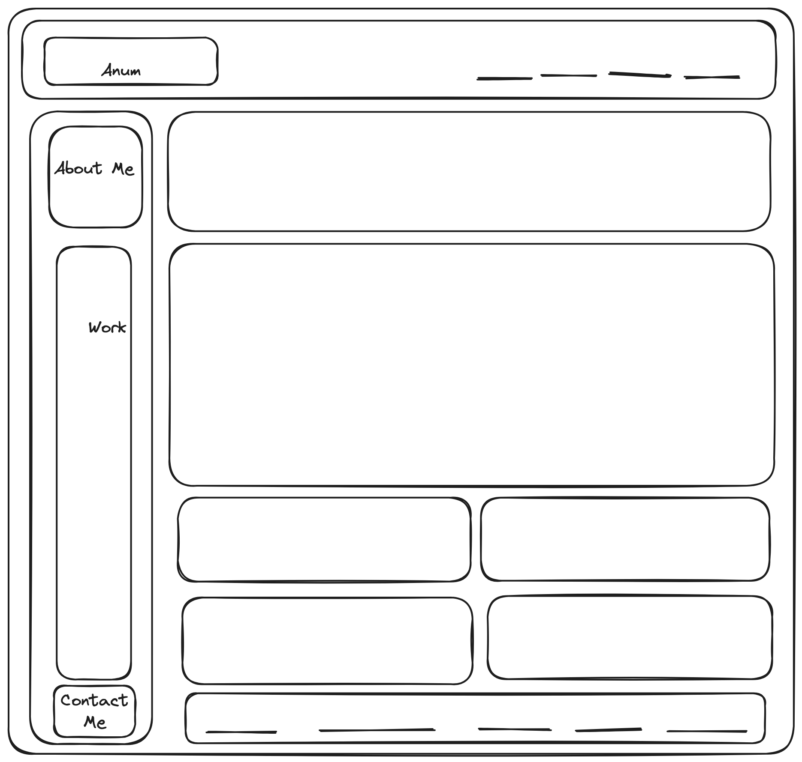

# Anum-Profile

## Description

- The project was built to detail about My personal profile that contains information about myself as well as my work, Resume, social media contact information etc
- The project was build using wireframe to work out the layout of the project

- The link to my deployed application is here
  https://anumrasheed.github.io/Anum-Profile/
- The project has semantic HTML elements and made sure HTML elements follow a logical structure.
- The website has been designed to be responsive and it has used flex box, grids and media queries
- Media queries have been used to make the website responsive for small screens

## Table of Contents

- [Usage](#usage)
- [Credits](#credits)
- [License](#license)

## Usage
- Each menu item features different aspects of Anum's personal Profile. To use this website, you can go to the top navigation bar and click on the relevant links to follow the details related to each menu
- Main sections comprise of About-Me details, Work details, Contact-Me Information
- About-Me section provides details about Anum
- Work section contains images of Anum's applications. When images of the applications are clicked then the user is taken to that deployed application
- Contact-Me section provides details about personal contact information, email and social media information.
- Below is the screenshot to the web application

## Credits

I followed tutorials from Kevin Powell for basic concepts of CSS 
-https://www.patreon.com/kevinpowell

## License

Please refer to the LICENSE in the repo.
